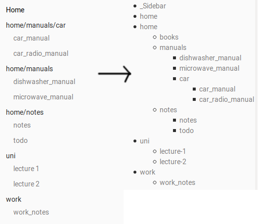

# Wiki/Productivity Scripts

This repo provides a set of scripts used to improve the functionality of markdown-based gitlab wikis.
It also has some handy scripts to help my uni workflow.

Gitlab repositories have their own wiki, which is contained in a separate git repo.

## Install/Setup

create a new config file:

```bash
cp config-example.yml config.yml
```

Edit the config as required.

TODO put some docs here

## Scripts

### Nested Sidebar Generator

Sidebars in gitlab are annoying as hell. They don't support nested directories, and a sidebar for a large wiki gets super unwieldy.  

this script generates a `_Sidebar.md` file which can be added to the root wiki directory for proper nested sidebars.



```
usage: sidebar_generator.py [-h] [--exclude EXCLUDE [EXCLUDE ...]]
                            [--max-depth MAX_DEPTH] [--hide-files] [--save]
                            [--wiki WIKI]

optional arguments:
  -h, --help            show this help message and exit
  --exclude EXCLUDE [EXCLUDE ...]
                        list of directories names to exclude. Includes all
                        subdirectories. Defaults to config file exclusions
  --max-depth MAX_DEPTH
                        maximum depth to build tree
  --hide-files          Only build the sidebar using directories, hiding files
  --save                save to _Sidebar.md in wiki directory, instead of
                        outputting to stdout
  --wiki WIKI           wiki root directory

```

note that the `--exclude` defaulting to the config file isn't yet implemented - it defaults to none.

### Subdirectory Contents Page Generator

With large wikis, a single non-compressible sidebar can get unwieldy.
This script recursively generates "contents pages" in each directory which have the same name as the directory (for example, `uni/` would have a file called `Uni.md`).
The contents page show the directories and the files within the current directory.

```
usage: contents_generator.py [-h] [--readme] [--exclude EXCLUDE [EXCLUDE ...]]
                             [--wiki WIKI]

optional arguments:
  -h, --help            show this help message and exit
  --readme              Name each file README.md
  --exclude EXCLUDE [EXCLUDE ...]
                        list of directories names to exclude. Includes all
                        subdirectories. Defaults to config file exclusions
  --wiki WIKI           wiki root directory

```

optionally you can name all the files README.md so that they automatically get displayed in the code repo.

This script will be extended in the future to recursively show subdirectories in each contents page, rather than just the files and folders in the same folder.

### Lecture Slides from URL

description of why I made this

### script title
